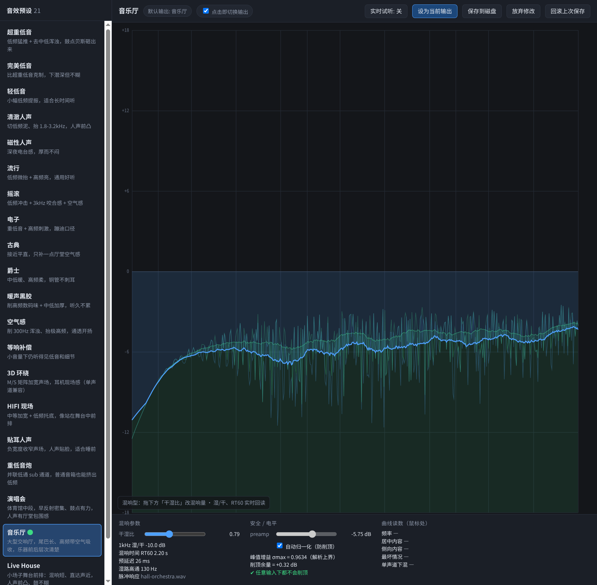

# yinxiao (音效)

One-command, instantly switchable sound-effect presets for Linux — rebuilding the
Dolby / DTS / Realtek style DSP that Windows ships with OEM drivers, using PipeWire's
native `filter-chain`. 21 presets stay resident; switching is just re-pointing the default
sink, so **no service restart, no audio drop-out**.

* **21 presets** — bass / vocal / genre / spatial / **convolution reverb halls** (concert, concert hall, live house, cathedral)
* **Web curve editor** — drag points to tune EQ, audition live, watch the response curve
* **Provably no clipping** — every preset has a verified worst-case gain bound σmax ≤ 1
* **No third-party runtime deps** — pure Python standard library (numpy optional, only speeds up IR synthesis)
* **Self-healing** — replug your USB DAC and the routing + last effect come back automatically

```bash
git clone https://github.com/matsuzaka-yuki/yinxiao.git
cd yinxiao && bash install.sh
yinxiao concert        # switch preset (ids, Chinese names, or prefixes)
yinxiao edit           # open the editor at http://127.0.0.1:8787
```



---

## Why

Windows gets Dolby / DTS / Realtek effects from closed-source OEM drivers; Linux has no
equivalent. EqualizerAPO plus a convolver can get you most of the way, but the config is
scattered, hard to move between machines, and easy to clip.

This project takes a different route: **a set of always-resident PipeWire filter-chain
presets**. Each preset is its own virtual sink plus filter chain, with its output pinned to
your physical card via `node.target`. Switching effects = switching the default sink.

## Presets

| Group | Presets | Notes |
|---|---|---|
| Bass | 超重低音 / 完美低音 / 轻低音 / 重低音炮 | four flavours of bass lift |
| Vocal | 清澈人声 / 磁性人声 / 贴耳人声 | forward, radio-warm, intimate |
| Genre | 流行 / 摇滚 / 电子 / 古典 / 爵士 / 暖声黑胶 | per-genre tone shaping |
| Spatial | 3D 环绕 / HIFI 现场 / 空气感 / 等响补偿 | M/S widening, air, loudness compensation |
| Halls | **演唱会 / 音乐厅 / Live House / 大教堂** | convolution reverb, RT60 1.1 / 2.2 / 0.6 / 3.5 s |

The hall presets use real convolution: `gen_irs.py` synthesises four stereo impulse
responses in pure Python (early reflections + three-band decaying tail + air absorption)
and PipeWire's built-in `convolver` loads them. Dry/wet is live-adjustable in the editor;
reverb time is a property of the IR, so changing it means switching preset.

## Install

**Requirements**: PipeWire (with the `pipewire-pulse` compat layer), `python3` ≥ 3.8,
systemd user session, one physical output device. Tested on CachyOS / PipeWire 1.6.9.

```bash
git clone https://github.com/matsuzaka-yuki/yinxiao.git
cd yinxiao
bash install.sh                  # auto-detect the physical sink
bash install.sh --sink <name>    # or specify it
bash install.sh --dry-run        # see what it would do first
```

The installer detects your card, generates the 21 preset confs and 4 IRs, installs the CLI
plus two systemd user services (`yinxiao-heal` for replug recovery, `yinxiao-editor` for the
web UI), and reloads PipeWire.

To have it running right after boot without logging into a desktop:

```bash
sudo loginctl enable-linger $USER
```

Uninstall: `bash uninstall.sh` (keeps your data), `bash uninstall.sh --purge` (removes everything).

## Usage

```bash
yinxiao list             # list all presets ( ● marks the active one )
yinxiao next / prev      # cycle
yinxiao off              # bypass everything, straight to the physical card
yinxiao status           # state, with warnings if the device is gone or links are wrong
yinxiao edit             # web editor
yinxiao fix              # re-link preset outputs back to the physical card (idempotent)
yinxiao heal             # daemon: recover automatically when the DAC drops and returns
```

**Editor** (`http://127.0.0.1:8787`): click a preset to switch to it immediately; drag points
to tune frequency/gain, scroll for Q, `Del` to remove a band. The green envelope is the
worst-case gain σmax, so you can see the remaining headroom at a glance. With
"auto-normalise" on, the preamp is recomputed as you edit — you cannot clip it by dragging.
Hall presets show a reverb panel instead (dry/wet live, RT60 / pre-delay read-only).

## Design notes

* **`node.target` is load-bearing** — without it WirePlumber chains your preset outputs into
  each other and effects stack up.
* **preamp is computed, never hand-written** — the peak of the whole chain's real frequency
  response is measured offline and inverted (EqualizerAPO's Preamp equivalent).
* **σmax ≤ 1** — we compute the largest singular value of the 2×2 transfer matrix, i.e. the
  worst-case gain for *any* input including hard-panned full-scale material. Reverb presets
  use an analytic bound instead, because a noise-like IR's spectrum fluctuates too fast for a
  frequency grid to catch its true peak.
* **Per-channel reverb send** — keeps the reverb's stereo image and avoids the ×2 penalty
  from correlated input summing in a shared mono send.

## Verification

The rule here is: measure before claiming anything.

```
load        21/21 sinks created, zero errors/warnings in the PipeWire log
gain        21/21 σmax ≤ 1 (mathematically cannot clip); re-check with eval_graph.py
EQ/matrix   26 measurement points via a null-sink probe: mean error 0.062 dB, max 0.518 dB
reverb      40 points (4 presets × 5 bands × L/R): mean error 0.225 dB, max 0.561 dB
            RT60 by Schroeder backward integration: 1.34 / 3.13 / 0.61 / 3.28 s
            independent hand-checked DFB convolution: σmax 0.74–0.82 after preamp
CPU         0.0% idle; 0.83% (one core) with two 4-second convolvers running
```

```bash
python3 ~/.local/share/yinxiao/eval_graph.py      # σmax table, non-zero exit if over 1
python3 ~/.local/share/yinxiao/e2e_reverb.py      # end-to-end reverb measurement (silent)
```

## Known limitations

* Bass enhancement is EQ + a parallel low-pass, not harmonic synthesis: this PipeWire build
  lacks `bass_enhancer` / `loudness` / `limiter`. Use EasyEffects / LSP for those.
* **Convolution reverb needs no EasyEffects** — `convolver` is a built-in PipeWire filter.
  Check yours with
  `strings /usr/lib/spa-0.2/filter-graph/libspa-filter-graph-plugin-builtin.so | grep convolver`.
  If it is missing, the 4 hall presets fail to load (the other 17 are unaffected).
* Reverb time is baked into the IR (edit `gen_irs.py` and regenerate); dry/wet is live.
* Presets end up at different overall loudness after preamp normalisation — that is the price
  of never clipping.
* After changing sound cards or machines, re-run `install.sh` (`node.target` stores a device name).
* `install.sh` regenerates the confs from the repo's parameters; back up anything you tuned in
  the editor first (every save leaves a `.bak`).

## License

MIT
